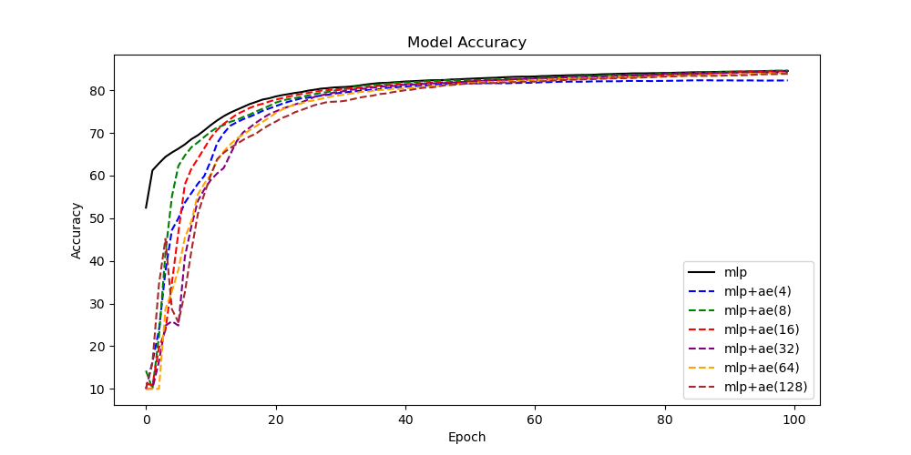
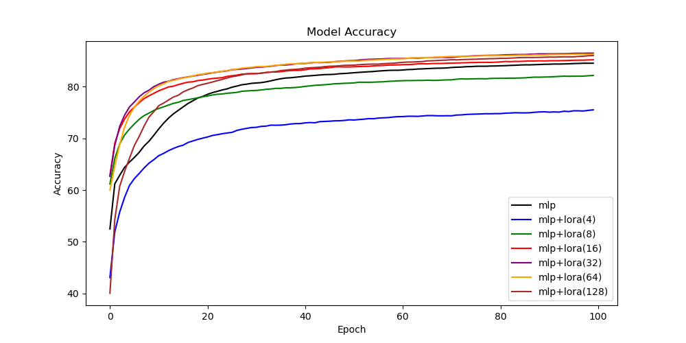
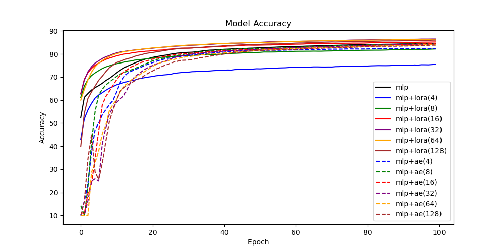

# LoRALinear
<u>Goal:</u> Understand better LoRA [[1]](#1) and whether one can use low-rank matrices directly instead of full-rank weight matrices.

<u>Main idea of LoRA:</u> We assume that updating a pre-trained model only requires updates of low-rank, i.e. for the weight matrix $W_0 \in \mathbb{R}^{d \times k}$ the update $\Delta W$ can be approximated by $\Delta W \approx BA$ with $B \in \mathbb{R}^{d \times r}, A \in \mathbb{R}^{r \times k}$ and $r \ll \min(d, k)$. This greatly reduces the number of trainable parameters and the GPU memory requirements.

<b><u>Question:</u> Can we also use this low-rank approximation directly and replace $W_0$ with $BA$?</b>

## Methodology

Trying to answer this question, we compare three different layers.

1. Full-rank linear layers: $$\text{Layer}(x) = \sigma(Wx + b) \text{ with } W  \in \mathbb{R}^{d_{out} \times d_{in}}$$
2. LoRA layers (custom weight initialization): $$\text{Layer}(x) = \sigma(ABx + b) \text{ with } A  \in \mathbb{R}^{d_{out} \times r},  B  \in \mathbb{R}^{r \times d_{in}}$$
3. Autoencoder (AE) layers (default weight initialization): $$\text{Layer}(x) = \sigma(\text{Layer}_2(\text{Layer}_1(x)))$$
with
$$
\text{Layer}_1(x) = Bx \qquad \text{ with } B  \in \mathbb{R}^{r \times d_{in}},  \\
\text{Layer}_2(y) = Ay + b \text{ with } A  \in \mathbb{R}^{d_{out} \times r}.
$$
Note that technically the second and third approach are almost identical, but in the third approach we use the default weight initialization of PyTorch and in the second approach we employ a weight initialization that depends on the rank $r$.

## Numerical results

To test these three approaches, we plug this into a simple MNIST classifier from the PyTorch tutorials [[2]](#2). The baseline implementation (method 1) is a fully connected neural network with $28\times28 \rightarrow 512 \rightarrow 512 \rightarrow 10$ neurons and for methods two and three we use ranks $r$ as powers of $2$. The full tests can be executed with
```
cd src; sh run.sh
```
We start by comparing the autoencoder layers (method 3) with the full-rank baseline (method 1).



We see that the autoencoder layers start with an accuracy of around $10 \%$ whereas the baseline starts at around $50 \%$ and converges faster to the final accuracy (which could still be greatly improved by hyperparamter tuning and architecture search).

Next, we compare the LoRA layers (method 2) with the full-rank baseline (method 1).



Here, we observe that the initialization of the LoRA layers (method 2) is significantly better than the default initialization (method 3), since the initial accuracy is closer to the baseline and converges faster. Moreover, we see that using too small of a rank, e.g. $r = 4$ or $r = 8$, leads to a reduced accuracy which was to be expected. 

Finally, we compare all three methods in a single plot.



Overall, we observe that <u>for this simple MNIST test case </u> it is beneficial to use low-rank representations of the matrices directly, as long as the weight matrices are initialized appropriately. It remains an open question whether this observation can be also made for more difficult problems.

## Extensions to LoRA
There has been a lot of other research LoRA. Some related papers include:

- LoRA+ [[3]](#3): better optimizer by proper, separate learning rate scaling of $A$ and $B$
- ReLoRA [[4]](#4): low-rank pre-training
- AdaLoRA [[5]](#5): adaptively changing rank $r$ during training
- GaLore [[6]](#6): low-rank approximation of <u>gradient</u> of weight matrix $W$ -> possible to pretrain LLaMA 7B on consumer GPU

## References
<a id="1">[1]</a> 
Edward J Hu, yelong shen, Phillip Wallis, Zeyuan Allen-Zhu, Yuanzhi Li, Shean Wang, Lu Wang, & Weizhu Chen (2022). LoRA: Low-Rank Adaptation of Large Language Models. In: International Conference on Learning Representations. Code: https://github.com/microsoft/LoRA. 

<a id="2">[2]</a> https://pytorch.org/tutorials/beginner/basics/quickstart_tutorial.html

<a id="3">[3]</a>
Soufiane Hayou, Nikhil Ghosh, & Bin Yu. (2024). LoRA+: Efficient Low Rank Adaptation of Large Models. arXiv preprint. Code: https://github.com/nikhil-ghosh-berkeley/loraplus.

<a id="4">[4]</a>
Vladislav Lialin, Sherin Muckatira, Namrata Shivagunde, & Anna Rumshisky (2024). ReLoRA: High-Rank Training Through Low-Rank Updates. In: The Twelfth International Conference on Learning Representations. Code: https://github.com/Guitaricet/relora.

<a id="5">[5]</a>
Qingru Zhang, Minshuo Chen, Alexander Bukharin, Nikos Karampatziakis, Pengcheng He, Yu Cheng, Weizhu Chen, & Tuo Zhao. (2023). AdaLoRA: Adaptive Budget Allocation for Parameter-Efficient Fine-Tuning. arXiv preprint. Code: https://github.com/qingruzhang/adalora.

<a id="6">[6]</a>
Jiawei Zhao, Zhenyu Zhang, Beidi Chen, Zhangyang Wang, Anima Anandkumar, & Yuandong Tian. (2024). GaLore: Memory-Efficient LLM Training by Gradient Low-Rank Projection. arXiv preprint. Code: https://github.com/jiaweizzhao/GaLore.
